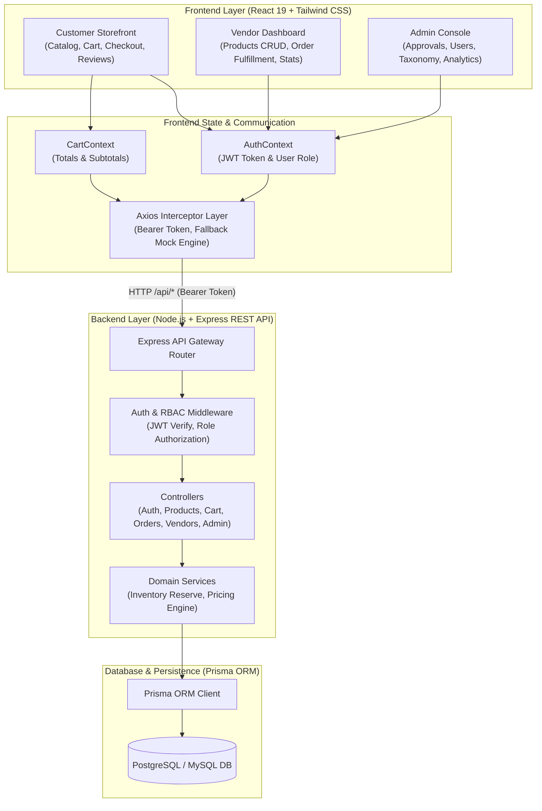
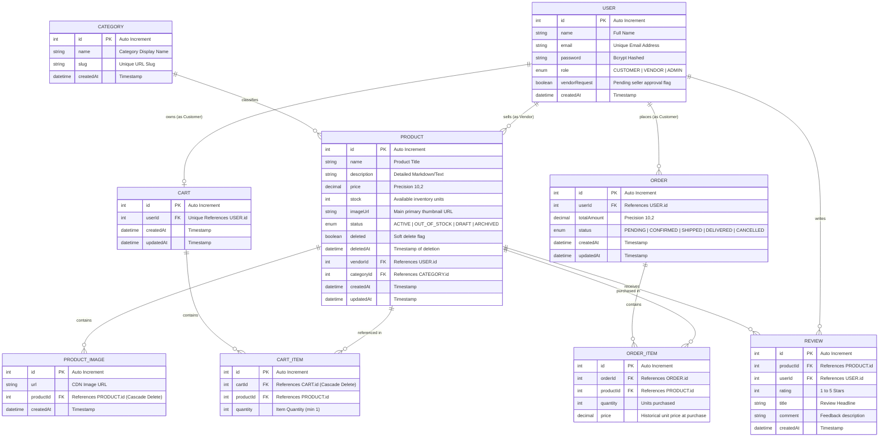
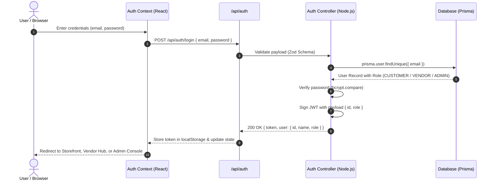
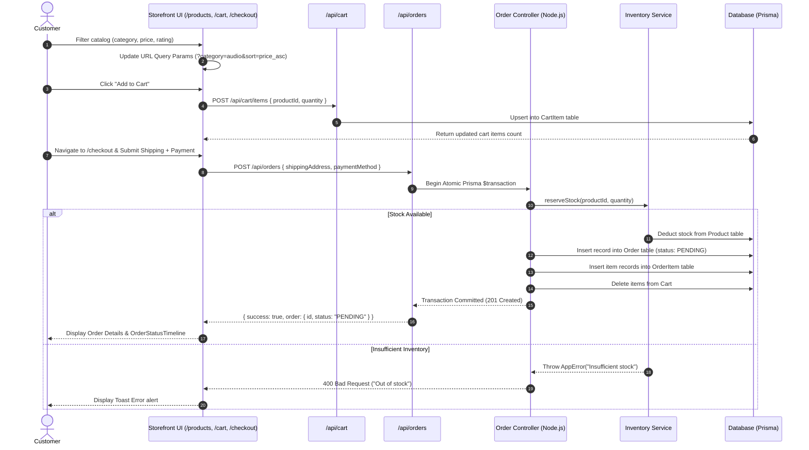
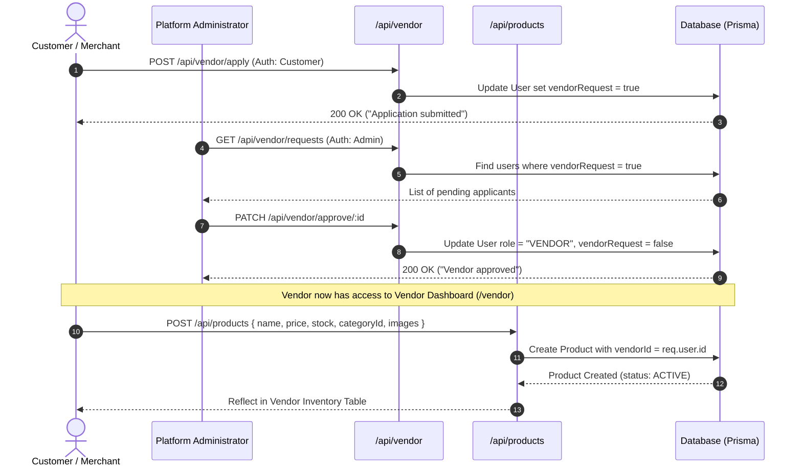
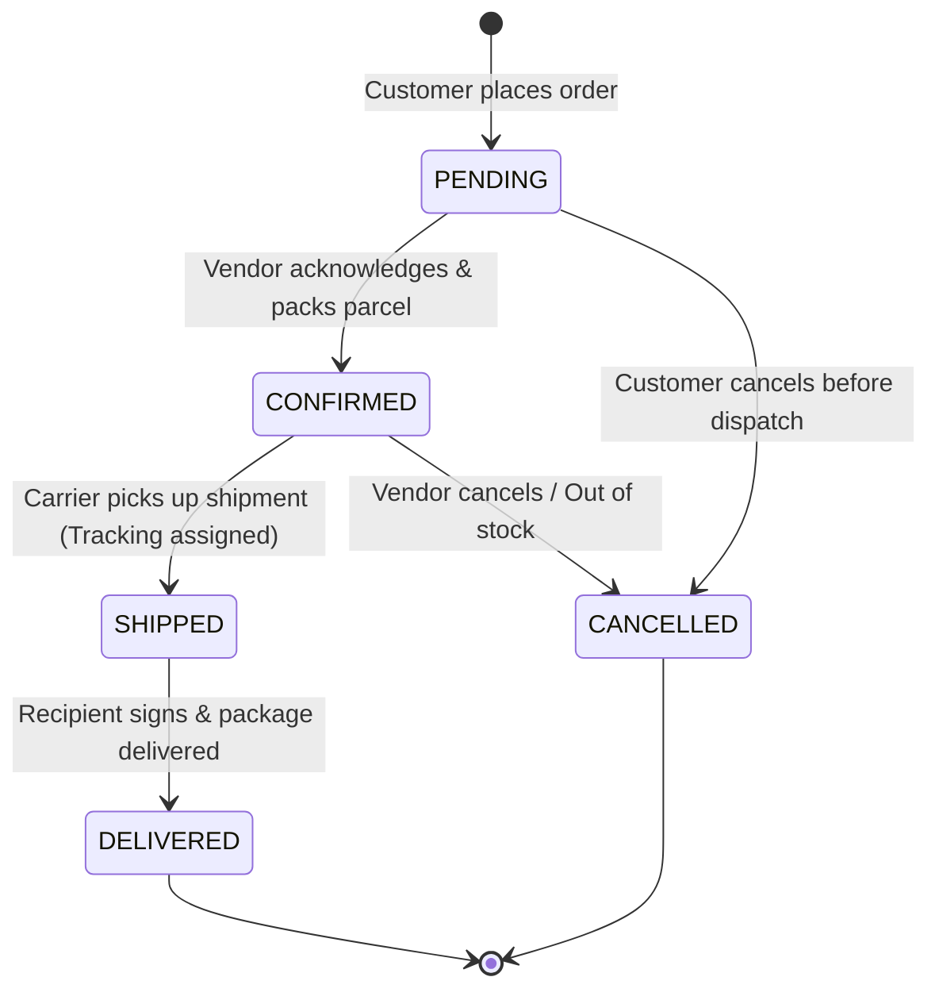
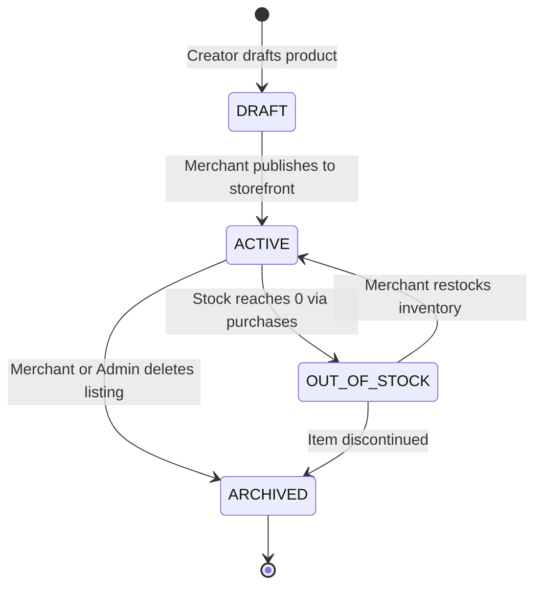

# Multi-Vendor E-Commerce Platform - Data Flow & ER Diagram

> [!TIP]
> **Instant Visual Diagram**: Open [ER_DIAGRAM.html](file:///c:/Users/gopal/Desktop/project/ECom/ER_DIAGRAM.html) in your web browser (Chrome, Edge, etc.) for a fully rendered, interactive, full-color diagram experience!

---

## 1. Visual Database Schema (ASCII Entity Relationship Blueprint)

```
+---------------------------------------------------------------------------------------------------------+
|                                        MULTI-VENDOR DATABASE SCHEMA                                     |
+---------------------------------------------------------------------------------------------------------+

  +-----------------------+              +-----------------------+              +-----------------------+
  |        USER           |              |       CATEGORY        |              |     PRODUCT_IMAGE     |
  +-----------------------+              +-----------------------+              +-----------------------+
  | PK  id (Int)          |              | PK  id (Int)          |              | PK  id (Int)          |
  |     name (String)     |              |     name (String)     |              |     url (String)      |
  | UK  email (String)    |              | UK  slug (String)     |              | FK  productId (Int)   |---+
  |     password (Hash)   |              |     createdAt (Date)  |              |     createdAt (Date)  |   |
  |     role (Enum)       |              +-----------------------+              +-----------------------+   |
  |     vendorRequest     |                          |                                                      |
  |     createdAt (Date)  |                          | 1                                                    |
  +-----------------------+                          |                                                      |
         |         |                                 | classifies                                           |
       1 |         | 1                               V *                                                    |
         |         |                     +-----------------------+                                          |
  places |         | sells (Vendor)      |        PRODUCT        |<-----------------------------------------+
         |         |                     +-----------------------+
         |         +-------------------->| PK  id (Int)          |
         |                               |     name (String)     |
         |                               |     description (Text)|
         |                               |     price (Decimal)   |
         |                               |     stock (Int)       |
         |                               |     imageUrl (String) |
         |                               |     status (Enum)     |
         |                               |     deleted (Boolean) |
         |                               | FK  vendorId (Int)    |
         |                               | FK  categoryId (Int)  |
         |                               |     createdAt (Date)  |
         |                               +-----------------------+
         |                                       ^         ^
         |                                     1 |       1 |
         |                                       |         |
         |                               purchased         | in cart
         |                                       |         |
         |                                     * |       * |
         |         +-----------------------+     |   +-----------------------+
         |         |         ORDER         |     |   |         CART          |
         |         +-----------------------+     |   +-----------------------+
         +-------->| PK  id (Int)          |     |   | PK  id (Int)          |
                   | FK  userId (Int)      |     |   | UK  userId (Int)      |<---+ (1-to-1 User)
                   |     totalAmount (Dec) |     |   |     createdAt (Date)  |
                   |     status (Enum)     |     |   +-----------------------+
                   |     createdAt (Date)  |     |               | 1
                   +-----------------------+     |               | contains
                               | 1               |               |
                               | contains        |               V *
                               V *               |   +-----------------------+
                   +-----------------------+     |   |       CART_ITEM       |
                   |      ORDER_ITEM       |     |   +-----------------------+
                   +-----------------------+     |   | PK  id (Int)          |
                   | PK  id (Int)          |     |   | FK  cartId (Int)      |
                   | FK  orderId (Int)     |     |   | FK  productId (Int)---+
                   | FK  productId (Int)---+-----+   |     quantity (Int)    |
                   |     quantity (Int)    |         +-----------------------+
                   |     price (Decimal)   |
                   +-----------------------+

  +-----------------------+
  |        REVIEW         |
  +-----------------------+
  | PK  id (Int)          |
  | FK  productId (Int)---+-----> [PRODUCT]
  | FK  userId (Int)------+-----> [USER]
  |     rating (Int 1-5)  |
  |     title (String)    |
  |     comment (Text)    |
  |     createdAt (Date)  |
  +-----------------------+
```

---

## 2. Interactive Mermaid Architecture Diagram




---

## 2. Database Entity-Relationship Diagram (ERD)

The database schema manages relationships across **Users**, **Multi-Vendor Products**, **Taxonomy Categories**, **Shopping Carts**, **Orders**, and **Product Reviews**.



---

## 3. Data Flow Diagrams (DFD)

### 3.1 Authentication & Role-Based Access Control (RBAC)



---

### 3.2 Customer Shopping, Cart & Order Placement Flow

This flow illustrates the transactional journey from catalog browsing to inventory reservation and order fulfillment:



---

### 3.3 Vendor Onboarding & Product Lifecycle



---

## 4. Lifecycle State Machines

### 4.1 Order Status State Machine



### 4.2 Product Inventory State Machine



---

## 5. Summary Table of API Data Contracts

| Method | Endpoint | Access Role | Description |
| :--- | :--- | :--- | :--- |
| `POST` | `/api/auth/register` | Public | Register new Customer or Vendor account |
| `POST` | `/api/auth/login` | Public | Authenticate and retrieve JWT Bearer token |
| `GET` | `/api/auth/me` | Logged In | Retrieve current user profile and role |
| `GET` | `/api/products` | Public | Query products with search, category, price, sorting & pagination |
| `POST` | `/api/products` | Vendor, Admin | Create a new product listing linked to the authenticated vendor |
| `PUT` | `/api/products/:id` | Vendor (Owner), Admin | Update product specifications, inventory count, or pricing |
| `DELETE`| `/api/products/:id` | Vendor (Owner), Admin | Soft-delete / archive product from marketplace |
| `GET` | `/api/cart` | Customer | Fetch current shopping bag items and quantities |
| `POST` | `/api/cart/items` | Customer | Add product to bag or increment item quantity |
| `DELETE`| `/api/cart/items/:id`| Customer | Remove item from shopping bag |
| `POST` | `/api/orders` | Customer | Atomically place order, reserve stock, and clear cart |
| `GET` | `/api/orders/my-orders`| Customer | Fetch customer purchase history and order milestones |
| `PATCH` | `/api/orders/:id/status`| Vendor, Admin | Transition order status (`Pending` -> `Confirmed` -> `Shipped` -> `Delivered`) |
| `POST` | `/api/vendor/apply` | Customer | Submit applicant request for vendor merchant privileges |
| `PATCH` | `/api/vendor/approve/:id`| Admin | Approve pending merchant and promote user role to `VENDOR` |
| `GET` | `/api/categories` | Public | Fetch product category taxonomy hierarchy |
| `POST` | `/api/categories` | Admin | Create new product category and slug |
