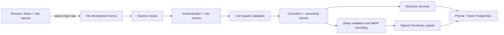
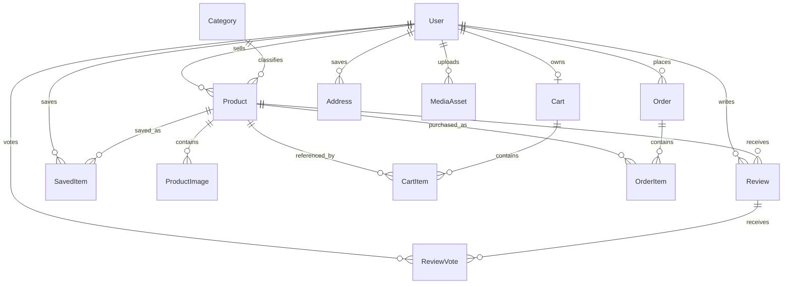

# FORME - architecture, data flow and entity relationships

This document describes the current implementation. The schema in `backend/prisma/schema.prisma` is authoritative; migration files under `backend/prisma/migrations/` reproduce it. [ER_DIAGRAM.html](ER_DIAGRAM.html) is a self-contained, printable schema reference that works without a CDN.

## System boundaries

```mermaid
flowchart LR
    B[Browser: React + role layouts] -->|same-origin /api| V[Vite development proxy]
    V --> E[Express routes]
    E --> A[Authentication + role checks]
    A --> Z[Zod request validation]
    Z --> C[Controllers + ownership checks]
    C --> S[Business services]
    S --> P[Prisma + Neon PostgreSQL]
    C --> M[Sharp validation and WebP encoding]
    M --> CL[Signed Cloudinary upload]
    CL --> P
```

Public catalogue/category/review reads bypass authentication where appropriate. Protected routes verify a JWT, fetch the current database user and enforce the current role. Ownership is checked separately from role. Request validation and database constraints protect shapes, identifiers and uniqueness. Shared error middleware returns errors without internal stack traces.

The local launcher starts Express/Vite using the configured Neon database. Database migration/seeding is explicit through db:setup or db:migrate/db:seed. It reports ready after the web page and proxied category API respond successfully, refusing invalid Neon URLs and occupied ports. Browser assets, fonts and seeded photographs are served locally after dependency setup. New uploaded images are stored in Cloudinary; their stable application links redirect to saved HTTPS CDN URLs.

## Domain model

```mermaid
erDiagram
    User ||--o{ Product : sells
    User ||--o| Cart : owns
    User ||--o{ Order : places
    User ||--o{ Address : saves
    User ||--o{ MediaAsset : uploads
    User ||--o{ Review : writes
    User ||--o{ ReviewVote : votes
    User ||--o{ SavedItem : saves
    Category ||--o{ Product : classifies
    Product ||--o{ ProductImage : contains
    Product ||--o{ CartItem : referenced_by
    Product ||--o{ OrderItem : purchased_as
    Product ||--o{ Review : receives
    Product ||--o{ SavedItem : saved_as
    Cart ||--o{ CartItem : contains
    Order ||--o{ OrderItem : contains
    Review ||--o{ ReviewVote : receives
```

| Entity | Purpose and key constraints |
| --- | --- |
| User | Unique email, bcrypt password hash, CUSTOMER/VENDOR/ADMIN role and pending vendor request flag. |
| Category | Unique slug; products reference a category; referenced categories cannot be deleted. |
| Product | Vendor/category ownership; Decimal price, integer stock, public/private status, soft deletion, specifications JSON. |
| ProductImage | Ordered photo URLs with descriptive alternative text. Product deletion cascades image rows. |
| MediaAsset | Server-generated upload identity, stable public URL, owner, byte count, optional unique Cloudinary public ID and HTTPS delivery URL. File bytes are outside PostgreSQL. Null cloud fields indicate legacy local storage. |
| Cart | At most one cart per user. |
| CartItem | Unique cart/product pair with positive quantity enforced by request/service logic. |
| Order | Customer, status, subtotal/delivery/total, address JSON snapshot, INR, delivery/payment choices and customer-scoped checkout key. |
| OrderItem | Unique order/product pair; bought quantity, unit price, product name and photo snapshots. |
| Address | Customer-owned delivery fields and default marker. Transactions keep one default where addresses exist. |
| Review | Unique customer/product pair, rating/title/body, visibility and moderation reason. Delivery eligibility is enforced in the service. |
| ReviewVote | Composite review/user key prevents duplicate helpful votes; authors cannot vote for themselves. |
| SavedItem | Composite customer/product key; quantity and price/name/photo snapshots preserve safe context when products change. |

Prices use PostgreSQL Decimal(10,2); service calculations use integer minor units where totals are computed. Product and order states are enums. One Order has one status, even when it contains several vendors.

## Checkout and cancellation

1. Customer sends a checkout key, expected total, delivery method and a saved or new address.
2. The server validates the customer, address ownership, bag and current product visibility/prices/stock.
3. A transaction reserves every item, calculates current subtotal/delivery, creates the order and its item/address snapshots, optionally saves a new address and clears the bag.
4. A conflict or insufficient stock on any line rolls back all changes. Retriable transaction conflicts are handled with bounded retries.
5. Repeating the same checkout key and request returns the saved order. Reusing it for another request is rejected.
6. PENDING can become CONFIRMED or CANCELLED; CONFIRMED can become SHIPPED or CANCELLED; SHIPPED can become DELIVERED. Final states cannot be reopened.
7. Cancellation restores stock once within a transaction. Visibility rules keep private drafts/archives private when stock changes.

Customer cancellation is limited to their own eligible orders. Vendors can fulfil only orders containing exclusively their own items. Admins handle all orders, including mixed-vendor ones. Shipping status is manually recorded; no carrier API is called.

## Reviews, media and saved items

- **Reviews:** a delivered order permits one customer/product review. Published reviews contribute to average/count/distribution. Admin hiding requires a reason and removes it from public aggregates. Author edits do not undo moderation. Helpful votes are unique per customer/review and cannot be self-votes.
- **Media:** vendor/admin uploads are checked for authentication, size, decoded format and dimensions. Sharp rotates/resizes and sends metadata-stripped WebP through signed Cloudinary uploads. Neon stores cloud metadata and ownership; stable image routes redirect to the CDN. Database-save failures trigger cloud cleanup. Media ownership prevents another vendor from attaching the upload, including by its CDN link. Product gallery order, cover and alternative text persist separately from file bytes. Explicit media:migrate moves legacy files without rewriting image references or deleting originals.
- **Saved items:** save/remove is repeatable; bag-to-saved and saved-to-bag operations are atomic. A failed price/stock check preserves the saved item. Existing bag quantities are merged without doubling on retry. Private product edits are not exposed through an old saved snapshot.
- **Discovery:** category/search/price/stock/rating filters apply before pagination. Only published ratings and delivered item quantities contribute to Highest rated and Best selling. Literal wildcard search characters are escaped.

## Code map

| Responsibility | Location |
| --- | --- |
| App assembly / startup | backend/app.js, backend/server.js |
| REST endpoints and guards | backend/routes/, backend/middleware/ |
| Accepted request contracts | backend/validations/schemas.js |
| Checkout, stock, addresses | backend/services/checkoutService.js, productStatusService.js, addressService.js |
| Catalogue, galleries, reviews | backend/services/catalogueService.js, productGalleryService.js, reviewService.js |
| Saved-item transactions | backend/controllers/savedController.js |
| Shared transaction retry | backend/services/transactionService.js |
| Role-aware browser routes | frontend/src/App.jsx, components/routing/ProtectedRoute.jsx |
| Customer / operational screens | frontend/src/pages/, frontend/src/components/management/ |
| Shared controls and motion | frontend/src/components/forme/, frontend/src/index.css |
| Neon configuration and startup | package.json, scripts/dev.mjs, scripts/runtime-config.mjs, scripts/environment.mjs, scripts/database.mjs |
| Repeatable verification | backend/tests/, frontend/tests/, scripts/runtime-config.test.mjs |

## API areas

All domain routes are under `/api`. Authentication is bearer-token based. See each route module for methods, body schemas and role middleware.

| Prefix | Responsibility |
| --- | --- |
| /auth | Register, login, current profile |
| /products | Public catalogue/details; seller-owned listing management, stock and restoration |
| /categories | Public categories; admin writes |
| /cart | Customer bag items and clear/merge operations |
| /saved | Customer saved products and bag transfers |
| /addresses | Customer address book/default selection |
| /orders | Customer checkout/history/cancellation; vendor fulfilment |
| /vendor | Customer application and admin approval |
| /admin | Platform statistics, users/roles, vendor filters, products and order management |
| /reviews | Public ratings/feedback, customer writes/votes, seller reads, admin moderation |
| /media | Authenticated image upload; public generated image serving |

## Deliberate limits

This is a college demo, not a public payment service. COD records the selected method without collecting money. No payment/transaction, shipment/tracking, refund, notification, tax or product-variant entity exists. Address data and product facts use the fields documented above. Management lists use client-side search/pagination over bounded demo datasets; production scale would require server-side pagination and operational controls.

For reproducible demonstration steps and current verification evidence, see [DEMO-GUIDE](docs/DEMO-GUIDE.md) and [VERIFICATION](docs/VERIFICATION.md).
